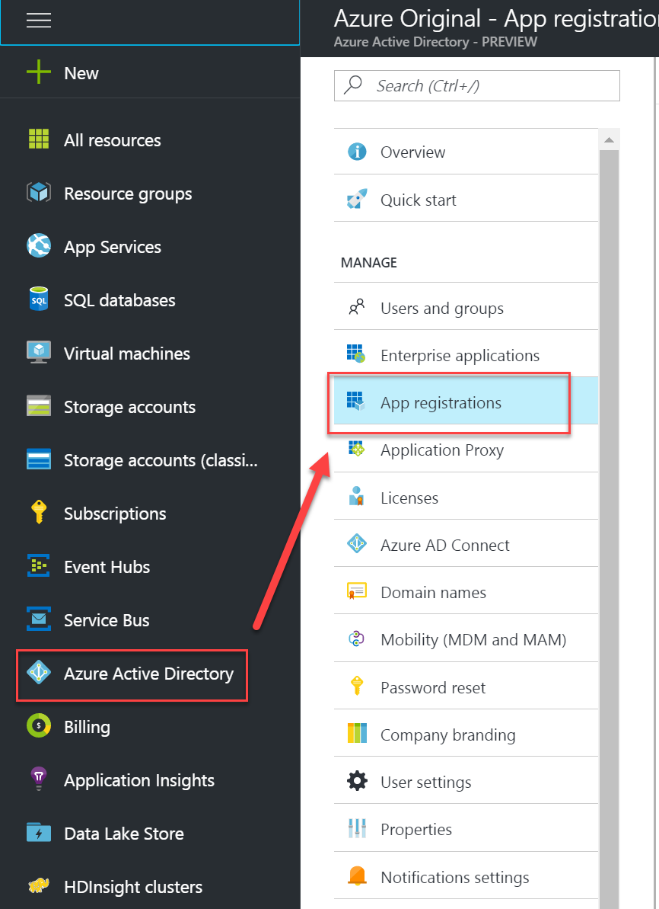
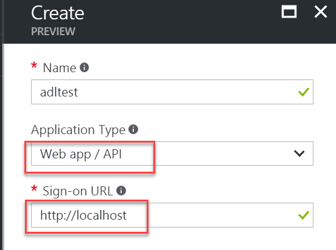
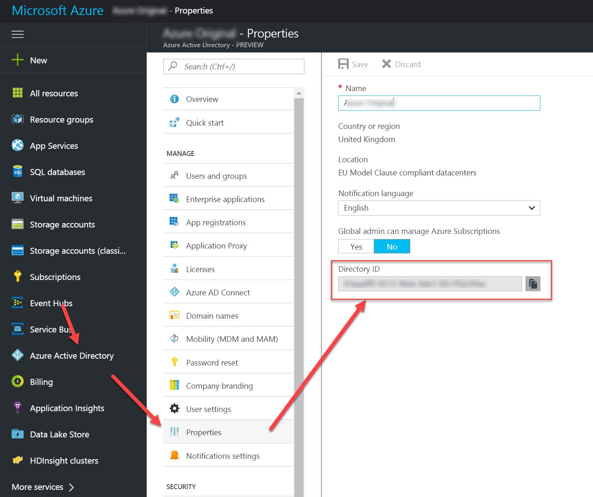

# Microsoft Azure Data Lake Store

Microsoft Azure implementations reside in a separate package hosted on [NuGet](https://www.nuget.org/packages/Storage.Net.Microsoft.Azure.DataLake.Store/). Follow the link for installation instructions.

This package tries to abstract access to [Azure Data Lake Store](https://azure.microsoft.com/en-gb/services/data-lake-store/) and making them available as `IBlobStorage`.

## Using

> WARNING!!! `Microsoft.Azure.Management.DataLake.Store` has a dependency on `Newtonsoft.Json v6` therefore you may need to add this to app.config:

```xml
<?xml version="1.0" encoding="utf-8" ?>
<configuration>
   <runtime>
      <assemblyBinding xmlns="urn:schemas-microsoft-com:asm.v1">
         <dependentAssembly>
            <assemblyIdentity name="Newtonsoft.Json" publicKeyToken="30ad4fe6b2a6aeed" culture="neutral" />
            <bindingRedirect oldVersion="0.0.0.0-9.0.0.0" newVersion="9.0.0.0" />
         </dependentAssembly>
      </assemblyBinding>
   </runtime>
</configuration>
```

This library supports service-to-service authentication either with a **client secret** or a **client certificate**.

## Appendix. Creating a Service Principal

### For authentication using Client Secret

#### Create Active Directory Application

Go to **Active Directory / App registrations**:



Press **Add button**. Type any name for the application, but leave **Application Type** as **Web app / API** and set **sign-on url** to **`http://localhost`**:



Now open the application and create a new key. We need to write down this **key** and **Application ID**:


You can get the **tenant id** (sometimes called a **diretory id** or **domain**) from the directory properties:



- 1
- 2
- 3